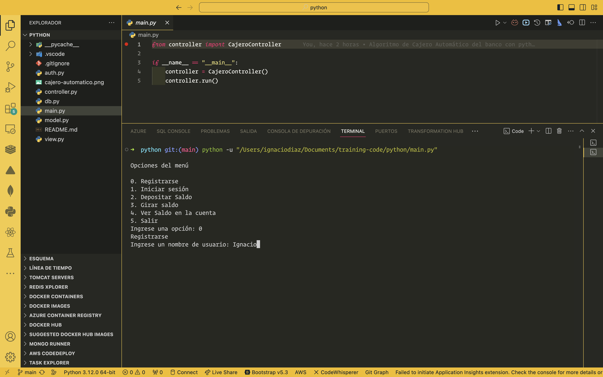

# Cajero Automático



Este proyecto implementa un cajero automático en Python con las siguientes funcionalidades:

- **Depositar Saldo:** Agrega fondos a la cuenta.
- **Girar Saldo:** Retira fondos de la cuenta.
- **Ver Saldo en la Cuenta:** Consulta el saldo actual.
- **Salir:** Finaliza la sesión del cajero automático.

## Estructura del Proyecto

La arquitectura sigue el patrón Modelo-Vista-Controlador (MVC), distribuido en los siguientes archivos:

- `modelo.py`: Gestiona la lógica y datos del cajero.
- `vista.py`: Proporciona la interfaz de usuario.
- `controlador.py`: Controla la interacción entre vista y modelo.

## Ejecución

Para utilizar el programa:

1. Asegúrate de tener Python instalado.
2. Ejecuta cada archivo (`modelo.py`, `vista.py`, `controlador.py`) en la terminal o en tu entorno de desarrollo.

## Uso

El programa muestra un menú interactivo en la terminal. Selecciona una opción ingresando su número correspondiente.

## Funcionalidad de Autenticación (Auth)

### Descripción

La funcionalidad de autenticación (`auth`) agrega la capacidad de registrar nuevos usuarios y permitirles iniciar sesión para acceder al cajero automático.

### Uso

La autenticación proporciona dos funciones principales:

- `registrarse`: Permite a los usuarios registrar un nuevo nombre de usuario y contraseña.
- `iniciarSesion`: Permite a los usuarios iniciar sesión utilizando su nombre de usuario y contraseña registrados.

### Implementación

La lógica de autenticación se encuentra en el archivo `auth.py`, el cual contiene la clase `AuthManager`. Esta clase gestiona el registro e inicio de sesión de usuarios mediante el uso de un diccionario para almacenar los nombres de usuario y las contraseñas.

### Ejemplo de Uso

Para registrar un nuevo usuario:

```python
auth_manager = AuthManager()
auth_manager.registrarse()

## Conexión a la Base de Datos PostgreSQL 16

### Descripción

El proyecto ahora incluye la capacidad de conectar y gestionar una base de datos PostgreSQL 16 para almacenar la información del cajero automático.

### Implementación

Para utilizar PostgreSQL 16 con el proyecto:

1. Asegúrate de tener PostgreSQL 16 instalado en tu entorno.
2. Configura los parámetros de conexión en el archivo `auth.py` o `modelo.py`.

### Configuración

Añade la información de conexión a PostgreSQL 16 en el archivo correspondiente (`auth.py` o `modelo.py`). Por ejemplo:

```python
# Configuración de la conexión a PostgreSQL 16
db_config = {
    'host': 'localhost',
    'database': 'nombre_de_la_base_de_datos',
    'user': 'usuario',
    'password': 'contraseña'
}